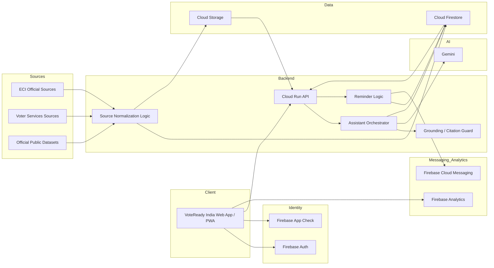
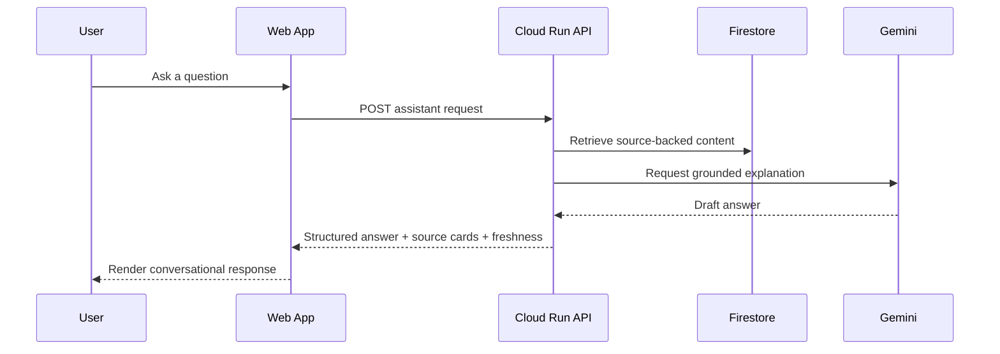
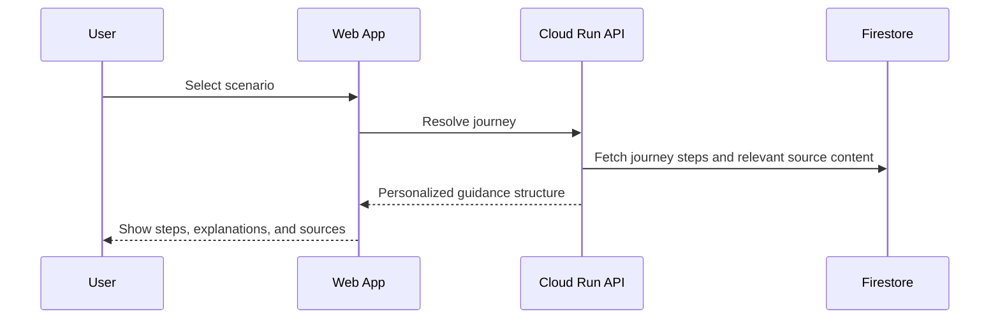
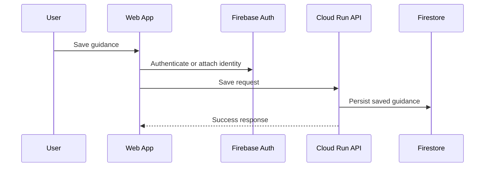
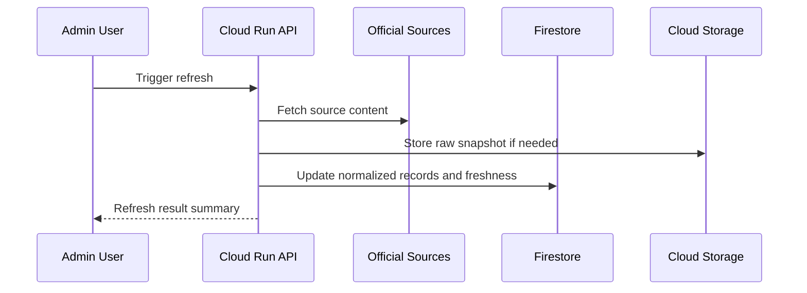
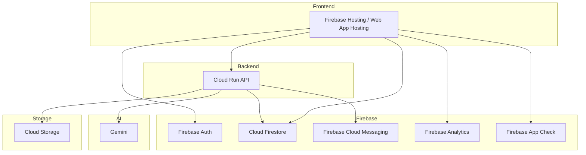

# VoteReady India Architecture Overview

## Document Metadata

| Field | Value |
|---|---|
| Document Title | VoteReady India Architecture Overview |
| Product | VoteReady India |
| Tagline | Ask. Understand. Be vote-ready. |
| Version | v1.0 |
| Status | Draft |
| Date | 2026-04-25 |
| Audience | Product owner, developers, Antigravity agents, reviewers, challenge evaluators |
| Related Documents | `README.md`, `skills.md`, `agents.md`, `docs/sources/source-registry.md`, `docs/testing/demo-checklist.md` |

---

## 1. Purpose

This document defines the target architecture for **VoteReady India**, an interactive civic education assistant focused on helping first-time and soon-to-be voters in India understand how elections work, what applies to their situation, and what to do next.

The architecture is designed to support:

- strong alignment with the PromptWars Challenge 2 problem statement
- clear and meaningful use of required Google services
- a conversational assistant experience, not just a static information portal
- source-backed and freshness-aware guidance
- a lightweight but credible build that Antigravity can implement safely in small tasks
- high scores across code quality, security, efficiency, testing, accessibility, and problem alignment

---

## 2. Product Framing

### 2.1 What VoteReady India is

VoteReady India is a **source-backed, conversational civic education assistant** for India’s first-time and soon-to-be voters.

It helps users:

- understand how elections work in India
- learn key election concepts in simple language
- ask questions conversationally
- explore scenario-based guidance such as first-time voting, turning 18 soon, moving cities, polling-day readiness, and voter-list confusion
- see official-source-backed procedural guidance with freshness indicators

### 2.2 What VoteReady India is not

VoteReady India is not:

- a clone of ECI portals
- a political persuasion app
- a candidate recommendation engine
- a complaint/reporting platform
- a results dashboard as its primary use case
- a generic chatbot without grounded answers

### 2.3 Core architecture implication

The assistant is the product.

Checklists, reminders, saved guidance, and timeline views are supporting layers around the assistant experience.

---

## 3. Architecture Goals

The architecture should satisfy these goals:

1. **Problem statement alignment first**  
   The system must behave like an informed election guide, not a static FAQ reader.

2. **Google-native implementation**  
   Google services must power real product workflows, especially Cloud Run and the broader Google AI toolchain.

3. **Source-backed trust**  
   Important procedural answers must be grounded in approved public official sources.

4. **Freshness and transparency**  
   The system should distinguish verified, stale, and unverified content.

5. **Conversational adaptability**  
   The assistant should support different explanation depths and user knowledge levels.

6. **Small-task Antigravity execution**  
   The codebase should support disciplined, incremental implementation without giant prompts.

7. **Challenge-ready quality**  
   The solution must remain maintainable, secure, testable, accessible, and efficient.

---

## 4. Scope Framing

### 4.1 In scope for the challenge build

- conversational election guide
- adaptive explanation modes
- scenario-based guided journeys
- election basics explainer
- source-backed answer cards
- timeline and key-procedure guidance
- multilingual/plain-language simplification
- saved guidance and reminder preferences
- basic source registry and freshness metadata
- Cloud Run-backed assistant orchestration
- Firestore-backed content and user state
- Firebase Auth for user-specific functionality
- Firebase Analytics for usage instrumentation
- optional FCM-based reminders if time permits

### 4.2 Out of scope for the challenge build

- large-scale live results system
- political prediction or candidate recommendation
- broad complaint filing workflows
- undocumented scraping of private/internal APIs
- real telephony/call-center infrastructure
- large admin consoles
- full nationwide source-ops complexity beyond what is needed for the challenge
- heavy ETL or large data platform work

---

## 5. Source Trust Model

VoteReady India must be **official-source-led**.

### 5.1 Approved source trust order

1. Election Commission of India official sources
2. Voters’ Services Portal and related official voter-service pages
3. Official ECI result and election information pages
4. Official public election datasets from trusted government/open data sources
5. Curated derived summaries only when traceable back to official sources

### 5.2 Architecture implications of source trust

The system must:

- store source metadata for key guidance content
- preserve source URL or canonical reference
- track jurisdiction context where relevant
- record `last_verified_at`
- mark content freshness state
- avoid presenting unsupported procedural guidance as authoritative

### 5.3 Unverified-answer rule

If the system cannot verify a procedural or deadline-sensitive answer from approved sources:

- it must not guess
- it must not present fabricated certainty
- it should state that the answer could not be verified
- it should route the user to the relevant official source path

---

## 6. High-Level Solution View

VoteReady India is a **Google-native web assistant system** with six main runtime areas:

1. **Web Experience Layer**  
   The user-facing app for conversation, guided journeys, timeline views, source cards, saved guidance, and settings.

2. **Assistant Orchestration Layer**  
   Cloud Run APIs that receive user queries, retrieve trusted source-backed content, invoke Gemini, structure responses, and enforce grounding rules.

3. **Content and Source Layer**  
   Firestore collections and optional Cloud Storage snapshots that store normalized source content, metadata, source registry entries, and freshness state.

4. **Identity and User State Layer**  
   Firebase Auth and Firestore-backed user data for saved guidance, preferences, and reminder configuration.

5. **Notification and Measurement Layer**  
   Firebase Analytics for product instrumentation and optional FCM for reminders.

6. **Admin / Source Operations Layer**  
   Lightweight maintenance flows for refreshing source data, updating freshness, and reviewing approved content.

---

## 7. Logical Architecture


---

## 8. Core Components

### 8.1 Web App

#### Responsibility

The web app is the primary user experience and should behave like a conversational civic guide.

#### Main capabilities

* ask questions about elections and voting in India
* choose guided scenarios
* switch explanation depth
* view source-backed answer cards
* see timelines and key procedures
* save useful guidance
* manage language preferences
* manage reminder preferences if included

#### UX requirements

* quick to understand
* mobile-friendly
* approachable for Gen-Z users
* accessible and high contrast
* readable without requiring civic background knowledge
* avoids textbook-like walls of content
* makes trust visible through sources and freshness

### 8.2 Cloud Run API

#### Responsibility

Cloud Run is the mandatory backend execution layer and must support a real, visible product path.

#### Why Cloud Run is central

Cloud Run should not exist only as a placeholder. It should perform meaningful work such as:

* assistant request handling
* query classification
* source retrieval
* prompt construction
* Gemini invocation
* response post-processing
* source-card assembly
* freshness and grounding checks
* reminder scheduling logic if included

#### Core endpoints

Suggested early endpoints:

* `POST /api/assistant/answer`
* `POST /api/guided-journey/resolve`
* `GET /api/timeline/:topicOrJourney`
* `POST /api/user/save-guidance`
* `POST /api/user/reminders`
* `GET /api/source/:sourceId`
* `POST /api/admin/source-refresh` if admin tooling is included

### 8.3 Assistant Orchestrator

#### Responsibility

This service translates user questions into structured, safe, source-backed answers.

#### Responsibilities include

* detect user intent
* identify question type:

  * general civic education
  * procedural guidance
  * timeline/deadline guidance
  * scenario-specific assistance
* fetch relevant normalized source content
* build grounded prompt context
* call Gemini
* enforce response structure
* attach source metadata
* downgrade confidence when grounding is weak

#### Guardrails

The assistant must not act like an unrestricted free-form answer engine.

It must prefer:

* grounded explanation
* plain language
* scope-appropriate answers
* transparency about uncertainty

### 8.4 Gemini Layer

#### Responsibility

Gemini provides explanation, summarization, simplification, and adaptive conversational responses.

#### Recommended Gemini use

* simplify election concepts
* explain official steps in plain language
* adapt explanation depth
* support multilingual simplification
* help turn source material into useful conversational guidance

#### Guardrail

Gemini should explain from approved content, not invent policy or procedural facts.

### 8.5 Firestore

#### Responsibility

Firestore is the main structured datastore.

#### Suggested collections

* `sources`
* `source_documents`
* `content_fragments`
* `journeys`
* `timelines`
* `faq_topics`
* `myth_fact_items`
* `users`
* `user_saved_guidance`
* `user_preferences`
* `user_reminders`
* `audit_logs`
* `admin_refresh_runs`

#### Firestore role split

Firestore should store:

* structured source metadata
* normalized content
* user-specific saved data
* freshness metadata
* reminder preferences
* minimal operational logs

### 8.6 Cloud Storage

#### Responsibility

Cloud Storage holds raw or semi-structured source artifacts when needed.

#### Good uses

* stored official PDFs
* downloaded CSV or ZIP source snapshots
* archived extracted HTML snapshots
* refresh-time evidence artifacts

#### Rule

Do not make Cloud Storage the primary query surface for the user app. It is an asset and evidence layer, not the main live content model.

### 8.7 Firebase Auth

#### Responsibility

Auth provides lightweight user identity for saved guidance, personalization, and reminders.

#### MVP usage

* anonymous or lightweight sign-in for saving progress
* email or federated auth if needed
* protect admin-only source operations
* distinguish public user vs admin/editor roles

### 8.8 Firebase App Check

#### Responsibility

App Check helps demonstrate credible client protection and controlled backend/resource access.

#### Use

* protect callable or HTTP-backed product paths where practical
* protect abuse-prone operations
* strengthen the challenge’s security story

### 8.9 Firebase Analytics

#### Responsibility

Analytics provides product and challenge evidence for engagement and completion.

#### Suggested event tracking

* assistant question asked
* guided journey started
* explanation mode switched
* source card opened
* saved guidance created
* reminder enabled
* language switched
* answer marked helpful

### 8.10 Firebase Cloud Messaging

#### Responsibility

FCM is optional but useful for reminder and nudge flows.

#### Example usage

* reminder about checking a required step
* polling-day readiness nudge
* saved-journey follow-up
* timeline-based alert

#### Rule

Only include if it strengthens the real product path and can be demonstrated cleanly.

---

## 9. Primary Product Flows

### 9.1 Conversational answer flow



### 9.2 Guided journey flow



### 9.3 Save guidance flow



### 9.4 Source refresh flow



---

## 10. Core Data Concepts

### 10.1 Source

Represents one trusted source entry.

Fields may include:

* `id`
* `title`
* `source_type`
* `canonical_url`
* `jurisdiction`
* `topic_tags`
* `last_verified_at`
* `freshness_status`
* `extraction_method`
* `is_active`

### 10.2 Content Fragment

Normalized usable content extracted from a source.

Fields may include:

* `id`
* `source_id`
* `topic`
* `language`
* `content_text`
* `summary_text`
* `procedural_importance`
* `effective_date`
* `last_verified_at`

### 10.3 Guided Journey

Represents a scenario such as first-time voter or moved recently.

Fields may include:

* `id`
* `journey_key`
* `title`
* `description`
* `eligibility_note`
* `steps`
* `linked_source_ids`
* `language_versions`

### 10.4 Timeline Item

Represents a key date or stage explanation.

Fields may include:

* `id`
* `topic`
* `jurisdiction`
* `event_name`
* `event_date`
* `importance_level`
* `why_it_matters`
* `linked_source_ids`
* `freshness_status`

### 10.5 User Saved Guidance

Represents a saved answer, journey, or checklist state.

Fields may include:

* `id`
* `user_id`
* `guidance_type`
* `reference_key`
* `saved_at`
* `language`
* `notes`
* `reminder_enabled`

---

## 11. Answer Design Rules

The assistant response model should be structured.

### 11.1 Standard answer shape

Where applicable, answers should include:

* short answer
* simple explanation
* step-by-step guidance
* what applies to the user
* source card(s)
* freshness note
* next action

### 11.2 Explanation modes

The system should support:

* **Quick**
* **Simple**
* **Detailed**

### 11.3 Grounding rule

Procedural or deadline-sensitive answers should include source visibility.

### 11.4 Uncertainty rule

Where grounding is weak, say so clearly.

---

## 12. Security Architecture

### 12.1 Security priorities

The challenge will score security, so the architecture should remain proportionate but credible.

### 12.2 Security rules

* secrets must not live in repo files
* `.env` values must not be committed
* service credentials must be stored securely
* admin-only operations must be protected
* user state changes must be authenticated where appropriate
* client input must be treated as untrusted
* Cloud Run must validate protected operations server-side

### 12.3 Sensitive flows

These require protection:

* admin source refresh
* privileged source edits
* reminder preference writes tied to user identity
* any editor or moderation actions

---

## 13. Accessibility and UX Guardrails

### 13.1 Accessibility goals

The system should score well on accessibility and feel usable for young users with varying civic literacy.

### 13.2 UX rules

* keep answers readable
* avoid long unexplained legal text
* use clear headings and spacing
* support keyboard use
* support screen-reader-friendly structure
* avoid color-only state communication
* make source and freshness labels easy to spot
* offer plain-language mode

### 13.3 Language usability

The assistant should favor understandable wording over bureaucratic wording.

---

## 14. Efficiency and Performance

### 14.1 Performance stance

The app should feel fast and responsive for the most important flows.

### 14.2 Efficiency rules

* avoid sending large raw source payloads to the client
* normalize source content ahead of time where possible
* use Cloud Run for meaningful orchestration, not for trivial proxying
* keep Firestore reads bounded and predictable
* cache stable content where appropriate
* lazy-load secondary UI surfaces

### 14.3 Challenge relevance

Efficiency matters both for score and for demo smoothness.

---

## 15. Testing Architecture

### 15.1 Testing priorities

The architecture should support tests for:

* answer grounding
* source metadata display
* freshness-state handling
* guided journey resolution
* user save flows
* reminder settings
* language-mode switching
* security boundaries on admin endpoints

### 15.2 Test layers

* **unit tests** for helpers, formatters, answer-shaping logic, freshness logic
* **integration tests** for Cloud Run API + Firestore behavior
* **manual demo checks** for conversational flows and challenge-critical journeys

### 15.3 Must-test challenge flows

* “How does voting work in India?”
* “I’m turning 18 soon. What should I know?”
* “I moved recently. What applies to me?”
* “Explain Lok Sabha vs Vidhan Sabha simply.”
* “What happens on polling day?”
* “Give me the short version” and “Explain in simple Hindi/Hinglish”
* stale or unverifiable answer handling

---

## 16. Observability and Auditability

Even in a challenge build, minimal observability helps trust and debugging.

### Recommended minimum signals

* assistant request received
* source retrieval performed
* Gemini call completed
* response returned with or without grounding
* save guidance action completed
* reminder preference updated
* source refresh started/completed
* admin action log entry created

### Audit note

Admin/source operations should leave a minimal audit trail.

---

## 17. Deployment View



### Deployment guidance

* frontend hosted as a web app/PWA
* Cloud Run used for meaningful assistant backend logic
* Firestore for structured data
* Cloud Storage for raw source artifacts where needed
* Firebase Auth for identity
* App Check enabled where practical
* Analytics enabled for usage evidence

---

## 18. Repo Mapping

Recommended repo shape for this architecture:

```text
VoteReady-India/
  .ai/
    templates/
    tasks/
  apps/
    web/
  services/
    api/
  packages/
    shared/
  docs/
    architecture/
    sources/
    testing/
  tests/
    unit/
    integration/
  scripts/
  skills.md
  agents.md
```

### Mapping guidance

* `apps/web` — UI and frontend app shell
* `services/api` — Cloud Run service
* `packages/shared` — shared types, helpers, constants
* `docs/sources` — source registry and trust documentation
* `docs/testing` — challenge demo checklist and validation notes

---

## 19. Architectural Build Sequence

Antigravity should implement the system in small, bounded tasks.

Recommended early sequence:

1. repo and app shell setup
2. web app scaffold
3. Cloud Run API scaffold
4. shared types and core answer contracts
5. source registry model
6. assistant request/response flow
7. guided journey flow
8. source-backed answer cards
9. save-guidance flow
10. multilingual/plain-language layer
11. reminders and analytics
12. admin/source refresh utilities if included

### Rule

Do not attempt to build the whole platform in one pass.

---

## 20. Key Architecture Decisions

1. The assistant is the primary product surface.
2. Cloud Run is mandatory and must power real application logic.
3. Gemini is used for explanation and simplification, not for unsupported invention.
4. Procedural guidance must be source-backed whenever applicable.
5. Firestore is the main structured data store.
6. Cloud Storage is an evidence/raw-source layer, not the main query store.
7. Firebase Auth supports saved user functionality and protected admin flows.
8. Firebase Analytics supports measurable usage and completion signals.
9. Freshness and uncertainty must be visible in the product.
10. The architecture must stay challenge-ready, maintainable, and easy for Antigravity to extend incrementally.

---

## 21. Future Extensions

Possible later improvements outside the initial challenge scope:

* voice or call-based assistant layer
* richer multilingual expansion
* polling-booth-level localized guidance where officially supportable
* broader civic learning modules
* stronger admin source operations
* document ingestion pipelines
* richer analytics dashboards

---

## 22. Summary

VoteReady India is architected as a **Google-native, source-backed civic education assistant**.

Its architecture combines:

* a conversational web experience
* Cloud Run-backed assistant orchestration
* Gemini-powered explanation and simplification
* Firestore-backed source and user state
* Firebase Auth, Analytics, and optional FCM
* a trust-first source model with freshness and uncertainty handling

This architecture is intentionally shaped to maximize:

* problem statement alignment
* correct Google service usage
* code quality
* security
* efficiency
* testing
* accessibility
* truthful demo credibility